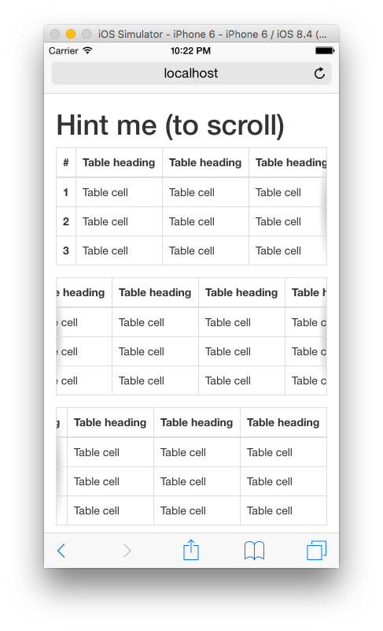

Bootstrap Responsive Table <br> Scrolling Shadows
=========================

Hints user if (and in which direction) the table is scrollable.

## Requirements

Bootstrap 3+

## Installation

Install via Bower:
```
bower install bootstrap-responsive-table-scrolling-shadows
```
And include ```bootstrap-responsive-table-scrolling-shadows.css``` after the main Bootstrap CSS.

## Usage

Use the normal Bootstrap responsive table approach.<br>
The magic is tied to the ```.table-responsive``` class.

```
<div class="table-responsive">
  <table class="table">
    ...
  </table>
</div>
```

## Demo

[Check out the demo](http://ikristjan.github.io/bootstrap-responsive-table-scrolling-shadows/)



## Acknowledgements

Inspired by [Roman Komarov](https://twitter.com/kizmarh)'s [scrolling shadows experiment](http://kizu.ru/en/fun/shadowscroll/).

## License

Copyright (c) 2015 Kristjan Lilleoja. Code released under [the MIT license](LICENSE).